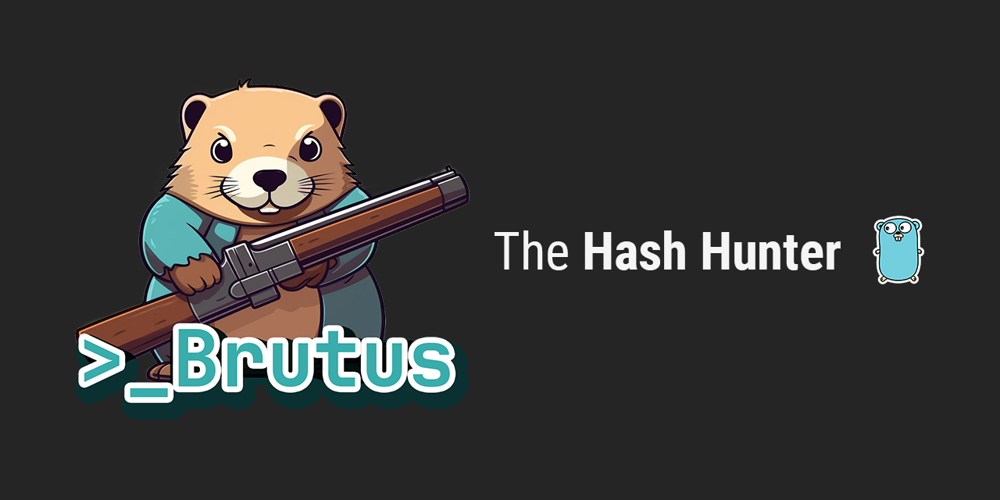

# Brutus-Hash-Hunter
**Brutus - The Hash Hunter** is a multithreaded CLI hash comparison program written in Golang.

***This is currently a work in progress and a project that I am building to learn more about Golang. I will only update the code as I have time.***

## Features
✔ **Compares SHA256 hash against wordlists**

✔ **Runs hashing comparison concurrently**

✔ **Configurable set of wordlists using yaml**

## Usage
config.yaml is used to configure the url to wordlist text files. Brutus will automatically download the specified wordlists into the `/wordlists/` directory. Alternatively, you may also manually download files and place them in the `/wordlists/` folder and add the file to the yaml file as shown below:
```yaml
wordListName:
    name: "wordlist"
    link: "anytext.txt"
```
Brutus will process any wordlist in the folder that matches a yaml entry `(name + ".txt")` so make sure that the name property matches the actual file name in the `/wordlists/` directory.

after configuring the yaml file, you may running the .exe or exeucte the command `go run .` from source. This will automatically download any files specified in the yaml file that do not exist in the `/wordlists/` directory.

finally, provide the hash in the prompt and press enter to search the wordlists

*Please use this program responsibly. You may not use this application or source code for any illegal purpose.*

