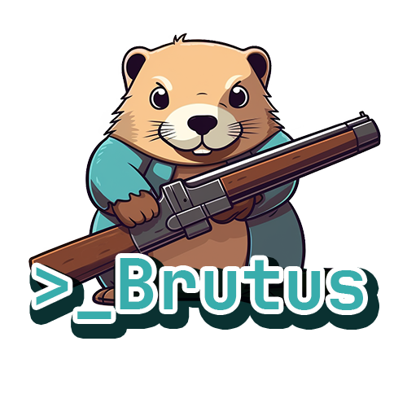

# Brutus-Hash-Hunter
Brutus - The Hash Hunter is a brute force password cracker written in Golang

***This is currently a work in progress and a project that I am building to learn more about golang. I will update this README when the project is at a usable state***

## Features

- Compare plain text passwords against lists
- Compare a password hash against wordlists

